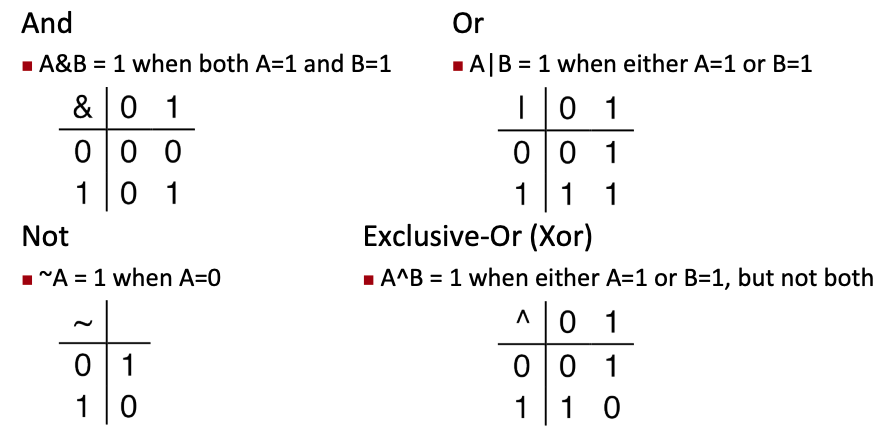
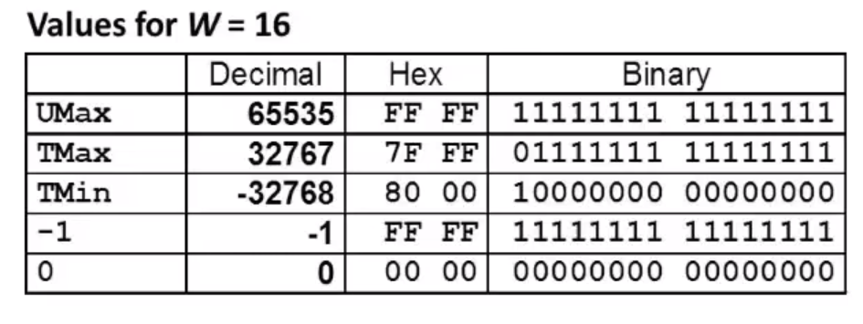
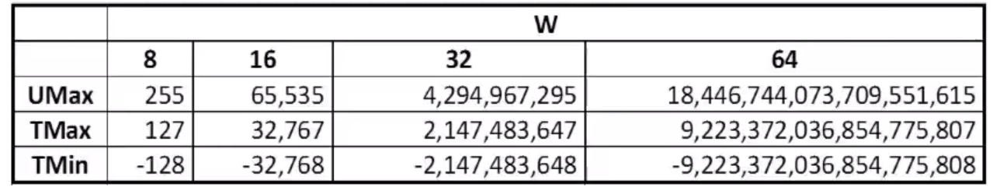
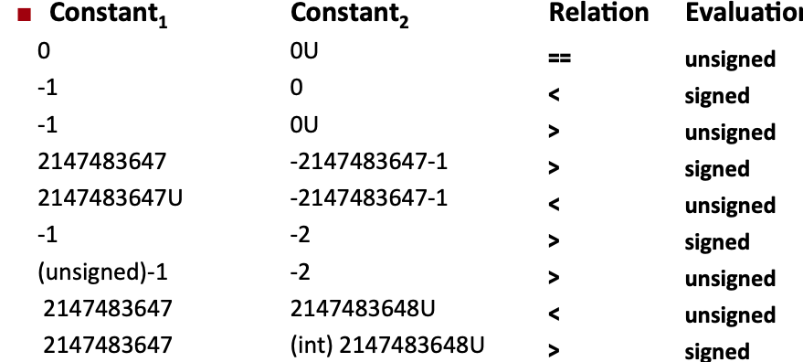
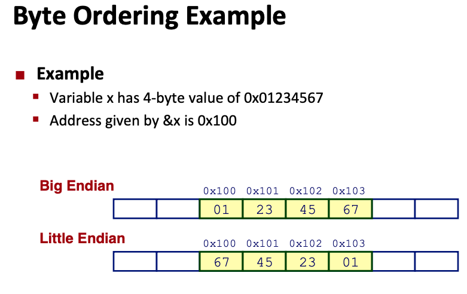
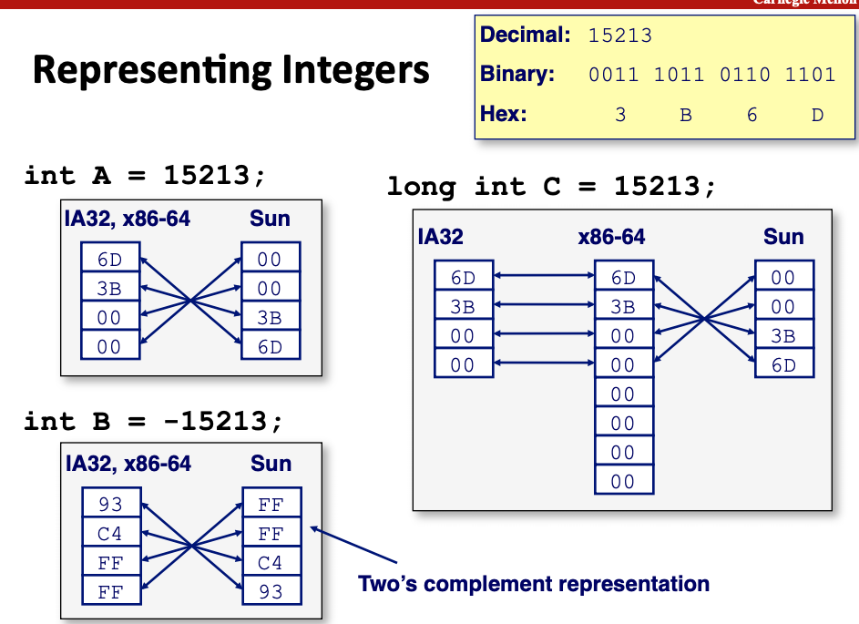

# Bits, Bytes and Ints

## Floating point Representation

```
Value  : 2 + 1  +  1/2 + 1/4 
binary : 1   1   .   1   1
Decimal: 3.75
```

---

## 1 Byte = 8 Bits

+ Binary : from 00000000 to 11111111 
+ Decimal: from 0  to 255 = 256 - 1 = 2^8 - 1
+ Hexadecimal: 00 to FF

    + Base 16 number representation
    + Use characters '0' to '9' and 'A' to 'F'
    + Write FA1D37B in C as: 0xFA1D37B or 0xfa1d37b

### Table

| Hexadecimal | Decimal | Binary |
| ----------- | ------- | ------ |
| 0           | 0       | 0000   |
| 1           | 1       | 0001   |
| 2           | 2       | 0010   |
| 3           | 3       | 0011   |
| 4           | 4       | 0100   |
| 5           | 5       | 0101   |
| 6           | 6       | 0110   |
| 7           | 7       | 0111   |
| 8           | 8       | 1000   |
| 9           | 9       | 1001   |
| A           | 10      | 1010   |
| B           | 11      | 1011   |
| C           | 12      | 1100   |
| D           | 13      | 1101   |
| E           | 14      | 1110   |
| F           | 15      | 1111   |


Tricks: 1010 = A = 10, 1100 = C = 12, 1111 = F = 15

---

## x86-64

+ char   :   1 byte =  8  bits
+ short  :   2 bytes = 16 bits
+ int    :   4 bytes = 32 bits
+ long   :   8 bytes = 64 bits
+ float  :   4 bytes = 32 bits
+ double :   8 bytes = 64 bits
+ pointer:   8 bytes = 64 bits

(In java, in addition to above, we have byte: 8-bits integer, boolean: true or false, char: 16-bits, a 64-bit JVM gives 64 bits for object or array references(addresses).)

---

## Boolean Algebra




```
1. And
    01101001
&   01010101
------------
    01000001

2. Or
    01101001
|   01010101
------------
    01111101

3. XOR (either but not both)
    01101001
^   01010101
------------
    00111100

4. Not
~   01101001
------------
    10010110
```

---

## Representing & Manipulating Sets

bit is 1 if the value is in the set, 0 if not.

```
Set1   :  {0,3,5,6}
Numbers:  76543210
Binary :  01101001

Set2   :  {0,2,4,6}
Number :  76543210
Binary :  01010101
```

Operations:

+ `&` = Set Intersection    :   01000001   {0,6}
+ `|` = Set Union           :   01111101   {0,2,3,4,5,6}
+ `^` = Symmetirc difference:   00111100   {2,3,4,5}
+ `~` = Complement of Set2  :   10101010   {1,3,5,7}

---

## Shift Operations

+ Left Shift: `x << y`

    + shift bit-vector x left y positions
    + Throw away extra bits on left
    + fill with 0's on right

+ Right Shift: `x >> y`

    + Shift bit-vector x right y positions

        + throw away extra bits on right

    + Logical shift: Fill with 0's on left
    + Arithmetic shift: Replicate most significant bit on left

+ Undefined Behavior

    + Shift amount < 0 or >= word size

--- 

Example:

```
x         : 01100010
<<3       : 00010000 (fill right with 0's)
Log   >>2 : 00011000 (fill left  with 0's)
Arith >>2 : 00011000 (fill left  with the most significant bit = 0)
```

```
x         : 10100010
<<3       : 00010000
Log  >>2  : 00010100
Arith >>2 : 11110100
```

---

## Numeric Ranges:


---

Go through this with 5 bits

Unsigned number:

```
Bit position : 4  3  2  1  0
values       : 16 8  4  2  1
---------------------------------
Bit pattern  : 0  1  1  0  1   x
---------------------------------
                  8 + 4  + 1 = 13
---------------------------------
Bit pattern  : 1  0  1  1  0   y
```

Signed number: Most significant bit has negative value

```
Bit position : 4  3  2  1  0
value        :-16 8  4  2  0
------------------------------
Bit pattern  : 1  0  1  1  0
------------------------------
              -16 + 4 + 2 = -10
```

----

## Ranges with 5 bits:

Unsigned numbers : 0 <= x <= 31 = 2^5 - 1

```
Umin
0  0  0  0  0
-------------
            0
-------------
Umax
1  1  1  1  1
-------------
           31
```

Signed numbers : -16 <= x <= 15 = 2^(5-1) - 1

```
Tmin
1  0  0  0  0
-------------
           -16
-------------
Tmax
0  1  1  1  1
-------------
            15
```



```
 1    1   1   1   1
-----------------------
-16 + 8 + 4 + 2 + 1 = -1
```



----

## Two's Complement: Mapping between Unsigned and signed

Two's complement -> Unsigned

Formala : + 2^w

```
2's complement: 11111 = -1
+ 2^w = 2^5 = 32
Unsigned      : 11111 = 31 
```

```
                    +31:  11111
                    .
                    .
                    .
                    16 :  10000
+15:   01111        
.
.                   
.
0  :   00000 ------>
-1 :   11111
.
.
.
-16:   10000
```

---

## Signed vs. Unsigned in C

+ We can declare explicitely Unsigned in C.

    Default are considered to be signed integers.

    Unsigned if have "U" as suffix

    ```
    0U
    4294734543U
    ```

+ Casting

    + Explicit casting between signed & unsigned changes the value

        ```
        int tx, ty;
        unsigned ux, uy;
        tx = (int) ux;
        uy = (unsigned) ty;
        ```

    + Implicit casting also occurs via assignment and procedure calls

        ```
        tx = ux;
        uy = ty;
        ```

    + If there is a mix of unsigned and signed in single expression. **Signed values implicitely cast to unsigned**
    + Including comparison operations <, >, ==, <=, >=
    + Example for W = 32: Tmin = -2,147,483,648 , Tmax = 2,147,483,647



Solution:

```
0 == 0U
---------------
-1 < 0
-1 > 0U, -1 = 111...111, so when this bit pattern is Unsigned, its value is Tmax. so > 0U
----------------------------
2147483647 > -2147483647-1
2147483647U < -2147483647 -1:

2147483647    = Tmax = 01111...111
-2147483647-1 = Tmin = 10000...000, when it beccomes a unsigned number, it is greater than Tmax
-----------------------------------
-1 > -2
(unsigned)-1 > -2 : -1 = 111...111
                    -2 = 111...110, when they are unsigned, -1>-2
------------------------------------
2147483647 < 2147483648U
2147483647 > (int) 2147483748U : we cast 2147483648U into int, so we are doing this comparison as signed number. 

2147483648U = 111...111 = -1 (signed) < 2147483647 
```

In C, don't write `-2147483648`, write `-2147483647-1`

---

## Sign Extension

+ Extend a w-bit signed integer x, convert it to a w+k bit integer with same value:

+ Rule:

    + Make K copis of sign bit

```
4 bit value:    0  1  1  0
extend it to 5 bit.
5 bit value: 0  0  1  1  0
---------------------------
4 bit value:       1  1  1  0 = -8 + 4 + 2 = -2
extend it to 5 bit
5 bit value:    1  1  1  1  0 = -16 + 8 + 4 + 2 = -2
extend it to 6 bit.
6 bit value: 1  1  1  1  1  0
            -32 16 8  4  2  1 
             -32 + 16 + 8 + 4 + 2 + 0 = -2

Intuition: copy another bit, it doesn't change anything.
``` 

----------

## Truncating: 

for unsigned

Just drop the most significant bits.

```
1  1  0  1  1 
16 8     2  1 = 27
just the most significant bit
Same as 27 mod 16
   1  0  1  1
   8     2  1 = 11
```

for signed, 2's complement

```
1  0  0  1  1
-16 + 2 + 1 = -13

   0  0  1  1
         2 + 1 = 3
```

---------

## Unsigned Addition

What if we end up with an extra bit, so what do we do??

two w-bits u + v => w+1 bits

we just drop the extra bit.

s = Add(u,v) in w-bits = u + v mod 2^w

Example: 4 bits : 0 - 15

```
   1 1 0 1    13
+  0 1 0 1     5
----------  
 1 0 0 1 0    18
   0 0 1 0     2
```

---

## Two's complement Addition

Just the same as regular

```
4 bits 2's complement: -8,...,0,...,7
    1 1 0 1     -3
+   0 1 0 1      5
-------------------
  1 0 0 1 0
    0 0 1 0      2
```

```
    1 0 1 1     -5
+   0 0 1 1      3
------------------
    1 1 1 0     -2
```
Negative overflow
```
    1 1 0 1     -3
+   1 0 1 0     -6
------------------
  1 0 1 1 1
    0 1 1 1     7
```
Positive overflow
```
    0 1 1 1     7
+   0 1 0 1     5
-----------------    
    1 1 0 0    -4    
``` 

Multiplication would be the same thing

---

## Signed multiplication in C

U * V (w bits) = uv (2w bits)

discard the first w bits.

```
5 * 4    = 20
00010100 = 20
---------------
    0100 = 4

5 * 5    = 25
00011001 = 25
------------------
    1001 = -8 + 1 = -7

    1101  -3 (13)
*   1110  -2 (14)
----------------
    0110  6  (182)
```

---------

Power-of-2 Multiply with Shift

+ Operation

    + u << k : shift u left by k bits : u * 2^k
    + Both signed and unsigned

On computers, shift is 1 cycle, multiplication used to take 32 cycles, now takes 3 cycles.

Unsigned Power-of-2 Divide with Shift

+ Quotient of Unsigned by Power of 2

    + u >> k : shift u right by k bits : floor(u/2^k)
    + Uses logical shift : fill left with 0's


    ```
    0 1 1 0   6
      >> 1
    0 0 1 1   3 
      >> 1
    0 0 0 1   1
    Even 3/2 = 1.5, integer division rounds down for this reason.
    ```

    How about unsigned number???

    ```
    1 0 1 0  |-6
    Arith >>1
    ------------
    1 1 0 1  |-3
    Arith >>1
    ------------
    1 1 1 0  |-2
    Here is the problem, we should round towards 0.
    1 1 0 1  |-3
    +     1 
    ----------
    1 1 1 0  |-2
    Arith >>1
    ----------
    1 1 1 1  |-1
    ```

    Division is very slow with any machine. try not to use division.

---------------------

## How to negate a number

x -> -x

```
1 0 1 0  | 6
~   flip
-------
0 1 0 1
+     1
--------
0 1 1 0  | -6
```

----------------

## Summary:

Addition and Multiplication: signed and unsigend number are the same.


--------------

In java, there is only 2's complement number.

`>>>` triple right shift is logical shift, i.e. fill left with 0's,

`>>` double right shift is arithmetic shift, i.e. fill left with the most significant bit.

-------------

## Mistakes

```c
#define DELTA sizeof(int)
int i;
for (i = CNT; i < DELTA >= 0; i-=DELTA) {...}
```

`sizeof` always return int, which is an Unsigned number. This will make i Unsigned, then the loop will never end.

Proper way to use Unsigned

```C
unsigned i;
for (i = cnt - 2; i < cnt; i--){...}
```
When i overflows, 0 - 1 = -1, then it wraps around bcomes UMAX, then it is greater than cnt. The loop stops.

Even better

```C
size_t i;       // size_t is defined as unsigned value with length = word size
for (i = cnt - 2; i < cnt; i--) {...}
```

----------

## Programs refer to data as address

+ Conceptually, envision it as a very large array of bytes

    + in reality, it's not, but can think of it that way
    + in reality, we do have 64-bits for pointer or address, but really only 47-bits are used in that. 2^47 is about 128 * 10^12

+ An address is like an index into that array

    + a pointer variable stores an address

---------

## Machine Words

Word size should be the same as how big machine uses for a pointer.

Nowadays, machines have 64-bit word size.

+ Potentially, could have 18PB(petabytes) of addressable memroy
+ that is 18 * 10^15

-----------

## Byte Ordering represetns address

Convertions:

+ Big Endian: no one uses this any more. Internet

+ Little Endian: x86, ARM processor running Android, IOS, windows

    + Least significant byte has lowest address

Example of Little Endian





-----------

## Some questions

always true or sometimes false, false give example

```
x < 0 => ((x*2) < 0) : False, TMIN breaks it.
------------------------------------------------
ux >= 0              : True, that is the whole point of unsigend number.
-------------------------------
x & 7 == 7  => (x<<30) < 0 : True
x must finish with 3 1's : x = ........111
x << 30 : shift right by 30: x = 1100..000 < 0
----------------------------------------------
ux > -1 : False, it is never true
-1 : 1111.....111
when compared with ux, this number becomes Unsigned, 
-1 = UMAX, ux is always < UMAX
-----------------------------------------------
x > y => -x < -y : False
TMIN = 1000...0000, find -TMIN
~      0111...1111
+1     1000...0000
TMIN = -TMIN
---------------------------------
x * x >= 0 : False
5 * 5 (in 4 bits) = 25
00011001
////1001
----------
-8 + 1 = -7
---------------------------------
x > 0 && y > 0 => x + y > 0 : False
positive overflow: 
7 + 5 = 12
  0111
+ 0011
-----
  1010 = -8 + 4 = -4
---------------------------------
x >= 0 => -x <= 0 : True

x <= 0 => -x >= 0 : False, try TMIN

Reason: because there is 0, there is one more negative number than positive, so not every negative number can be represented by positive, that is why -TMIN = TMIN, is itself.
------------------------------------------
(x|-x)>>31 == -1 : False, it works other than 0

x:  00000000000
~   11111111111
+1 100000000000
---------------
-x  00000000000

x|-x = 00000000000, then shift this wont work. However, this is the only counter example

x:  1010 = -6
~   
---------
    0101
+      1
---------
-x   0110 = 6
|    1010
----------
     1110 = -8+4+2 = -2
Arith>>3      
-----------
     1111 = -1
```