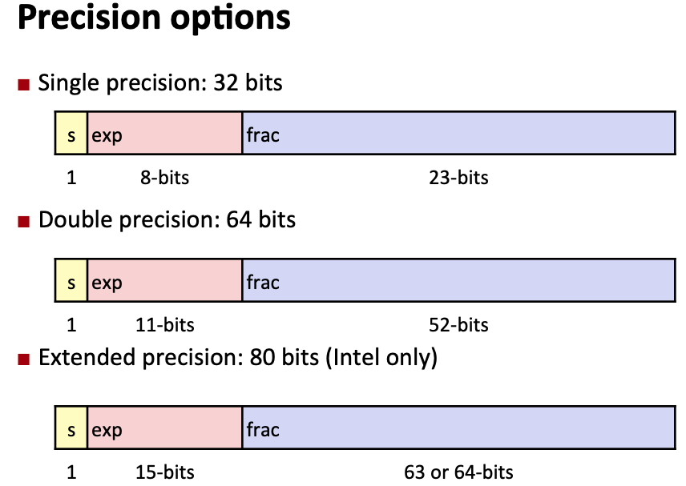
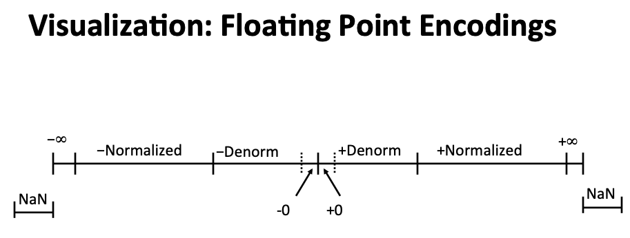
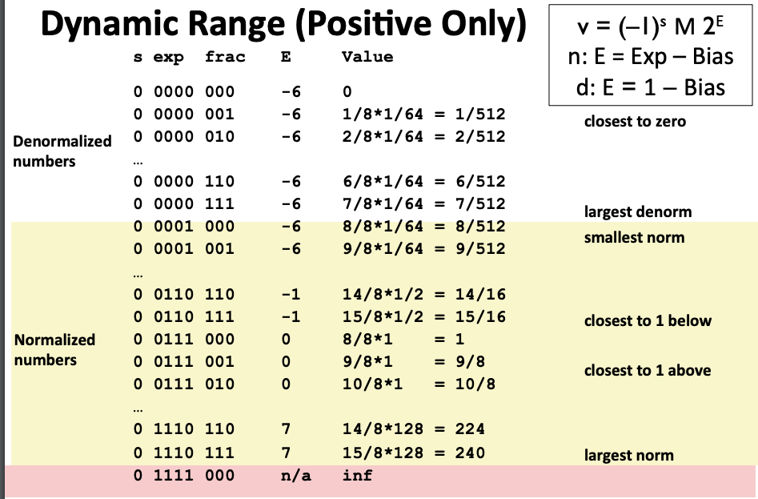
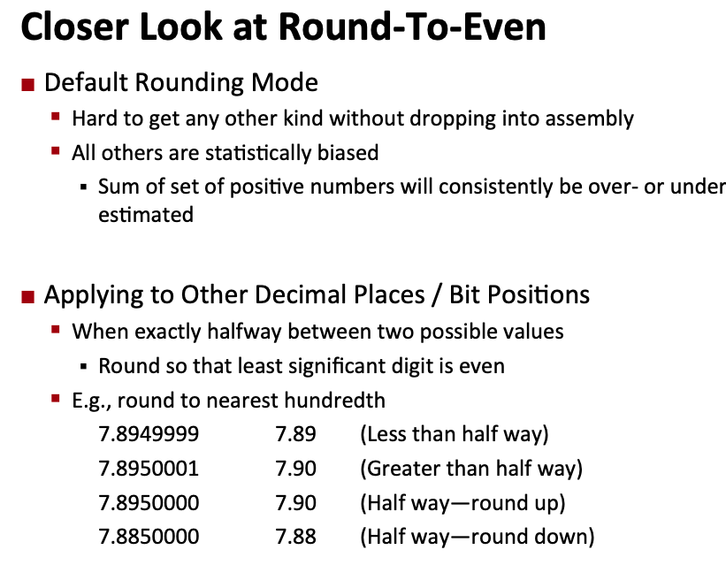

# Floating Point 

[Notes](http://www.cs.cmu.edu/afs/cs/academic/class/15213-f15/www/lectures/04-float.pdf)


---

Example:

```
5.75  :  101.11
         4 + 1 + 1/2 + 1/4 = 5 + 3/4
------------------------------------
2+7/8 :  10.111
         2 + 1/2 + 1/4 + 1/8 = 2 + 7/8
-------------------------------------
1 + 7/16 : 1.0111
          1 + 1/4 + 1/8 + 1/16 = 1 + 7/16
```

---------

+ Observations

    + Divide by 2 by shifting right (unsigned)
    + Multiply by 2 by shifting left
    + Number of form 0.111111.... are just below 1.0

        + 1/2 + 1/4 + ... + 1/2i + ... -> 1.0
        + use notation 1.0 - epislon

+ Limitation 1:

    + can only exactly represent numbers of the form x/2^k
    + other rational numbers have repeating bit representations
    + 1/3: 0.0101010101[01]...
    + 1/5: 0.001100110011[0011]...
    + 1/10: 0.0001100110011[0011]...

+ Limitation 2:

    + just one setting of binary point within the w bits.

        + Limited range of numbers(very small values? very large?)

----------------

## IEEE Floating Point

Up to 1985, it is just a disaster to use floating point.

Now everyone uses the same one.

-----------

## Floating point Representation

+ Numerical Form : (-1)^s * M * 2^E

    + Sign bit s determines whether number is negative or positive
    + Significand M normally a fractional value in range [1.0,2.0)
    + Exponent E weights value by power of two.

+ Encoding

    + MSB s is sign bit s
    + exp field encodes E (but is not equal to E)
    + frac field encodes M (but is not equal to M)



----------------------

## "Normalized" Values

+ When: exp != 000...000 and exp != 111...111
+ Exponent coded as a biased value: E = Exp - Bias

    + Exp: unsigned value of exp field
    + Bias = 2^(k-1) - 1, where k is number of exponent bits

        + single precision: 127 = 2^(8-1) - 1
        + Double precision: 1023

+ Significant coded with implied leading 1: M = 1.xxxxx

    + Minimum when frac = 000000, M = 1.00000
    + Maximum when frac = 111....1, M = 2 - epsilon

-----------------

## Normalized Encoding Example

```
v = (-1)^s * M * 2^E
E = Exp - Bias
```

```
Value : float F = 15213.0
------------------------------------
15213   =   11101101101101
        =  1.1101101101101 * 2^13
------------------------------------
Significand
M       =  1.1101101101101
frac    =    11011011011010000000000
-----------------------------------
Exponent
E       = 13
Bias    = 127
Exp     = 140 = 10001100
-------------------------------------
Result: 32 bits
s:1    exp:8 bits    frac: 23 bits
0     10001100      11011011011010000000000
```

```
0    <= exp <= 255 = 2^8 - 1
-127 <= E   <= 128
```

-------------------------

## Denormalized Values

```
v = (-1)^s * M * 2^E
E = 1 - Bias
```

+ Condition: exp = 00000...000
+ Exponent value : E = 1 - Bias(instead of 0 - Bias)
+ Significand coded with implied leading 0: M = 0.xxxxx...x

    + xxx...x: bits of frac

+ Cases:

    + exp = 000...0, frac = 000...0

        + Represents zero value
        + Note distinct values: +0 and -0

    + exp = 000...0, frac != 000...0

        + Numbers cloest to 0.0
        + Equispaced



-----------

## Tiny Floating Point Example

```
s: 1 bit   exp: 4-bits   frac: 3-bits
```

+ 8-bit Floating Point representation

    + the sign bit is in the most significant bit
    + the next 4 bits are the exponent, with a bias of 7
    + Bias = 2^(k-1) - 1, where k is number of exponent bits = 4
    + the last three bits are the frac

+ Same general form as IEEE Format

    + normalized, denormalized
    + representation of 0, NaN, infinity



```
Denormalized numbers:
E = 1 - Bias = 1 - 7 = -6
v = (-1)^s * M * 2^E
s  exp    frac    E    Value
0  0000   000    -6     0
0  0000   001    -6     1 * 1/8 * 1/64 = 1/512                 closest to zero
0  0000   010    -6     1 * 1/4 * 1/64 = 2/512
...
0  0000   110    -6     1 * (1/2 + 1/4) * 1/64 = 6/512
0  0000   111    -6     1 * (1/2 + 1/4 + 1/8) * 1/64 = 7/512    largest denorm
---------------------------------------------------
Normalized numbers:
E = Exp - Bias
M = 1 + frac in (1/2,1/4,1/8)
v = (-1)^s * M * 2^E
0  0001   000    1-7=-6 1 * 1 * 1/64 = 8/512                    smallest norm
0  0001   001    -6     1 * (1+1/8) * 1/64 = 9/512
...
0  0110   110  4+2-7=-1 1 * (1+1/2+1/4) * 1/2 = 14/16
0  0110   111    -1     1*(1+1/2+1/4+1/8)*1/2 = 15/16           closest to 1 below
0  0111   000    7-7=0  1*(1)*1 = 1
0  0111   001     0     1*(1+1/8)*1= 9/8
...
0  1110   110 8+4+2-7=7 1*(1+1/2+1/4)*2^7= 224
0  1110   111    7      1*(1+1/2+1/4+1/8)*2^7 = 240             largest norm
0  1111   000    n/a    inf
```

---------------


## Round to Even



## How ro round Binary Numbers

Binary Fractional numbers

+ "Even" when least significant bit is 0
+ "Half way" when bits to right of rounding position = 100...

Example:

Round to nearest 1/4 (2 bits right of binary point)

```
Value           Binary      Rounded   Action      Rounded value
2 + 3/32        10.00011    10.00     <1/2-down     2
2 + 3/16        10.00110    10.01     >1/2-up       2+1/4
2 + 7/8         10.11100    11.00     1/2-up        3
```

-----------------

## Floating point in C

C has:

+ float : single precision
+ double : double precision

Coversion/casting

+ Casting between int, float and double changes bit representation
+ double/float -> int

    + Truncates fractional part
    + Like rounding toward zero
    + Not defined when out of range or NaN

+ int -> double

    + Exact conversion, as long as int has <= 53 bit word size

+ int -> float

    + will round according to rounding mode

## Floating point puzzles

```C
int x = ...;
float f = ...;
double d = ....;
```
Assume neither d nor f is NaN

```
x == (int)(float) x
No, it loses some bits when you cast it to float
------------------
x == (int)(double) x
Yes, because we have enough bits in double
------------
f == (float)(double) f
Yes, because double has more bits.
---------------------
d == (double)(float) d
No, casint double to float loses some bits
-----------------------
f == -(-f)
Yes, it is a float, so we are only changing the sign bit back and forth.
---------------------
2/3 == 2/3.0
No, 2/3 = 0, 2/3.0 is a float.
---------------------
d < 0.0 => ((d*2) < 0.0)
Yes, even overflows, it overflows to negative infinity, otherwise, the sign bit won't be changed.
------------------------
d > f =>   -f > -d
Yes, we just change the sign bit for double and float.
------------------------
d * d >= 0.0
Yes
-----------------------
(d+f) -d == f
No, lack of associativity
```

## Floats is not associative.

Overflow and inexactness of rounding:

```
(3.14 + 1e10) - 1e10 = 0;
3.14 + (1e10 - 1e10) = 3.14;

1e20 * (1e20 - 1e20) = 0.0;
1e20*1e20 - 1e20*1e20 = NaN; it overflows
```