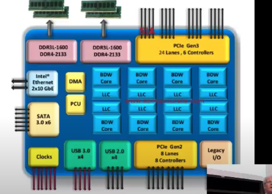
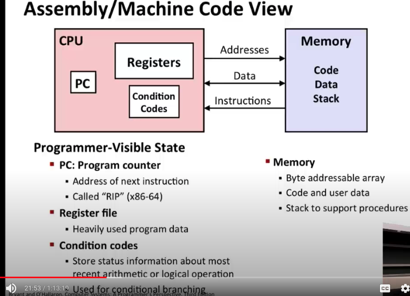
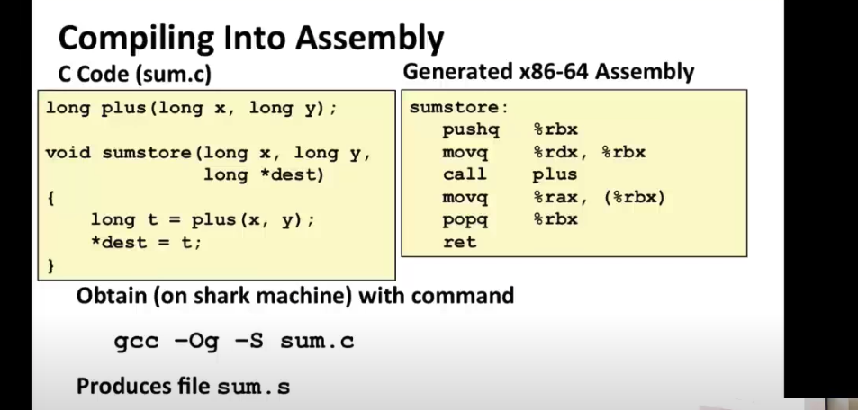
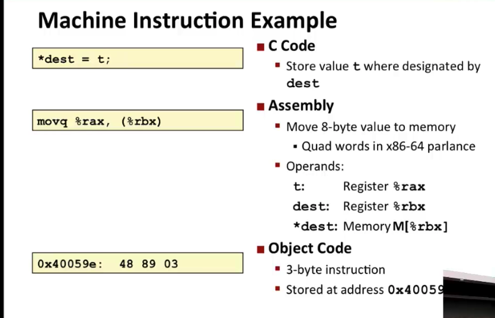
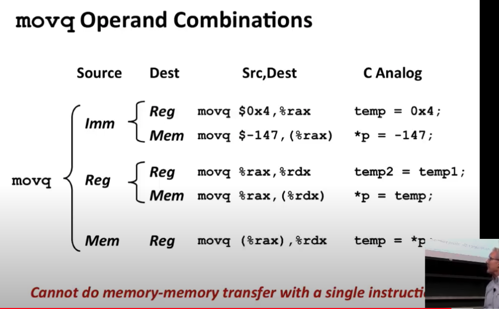
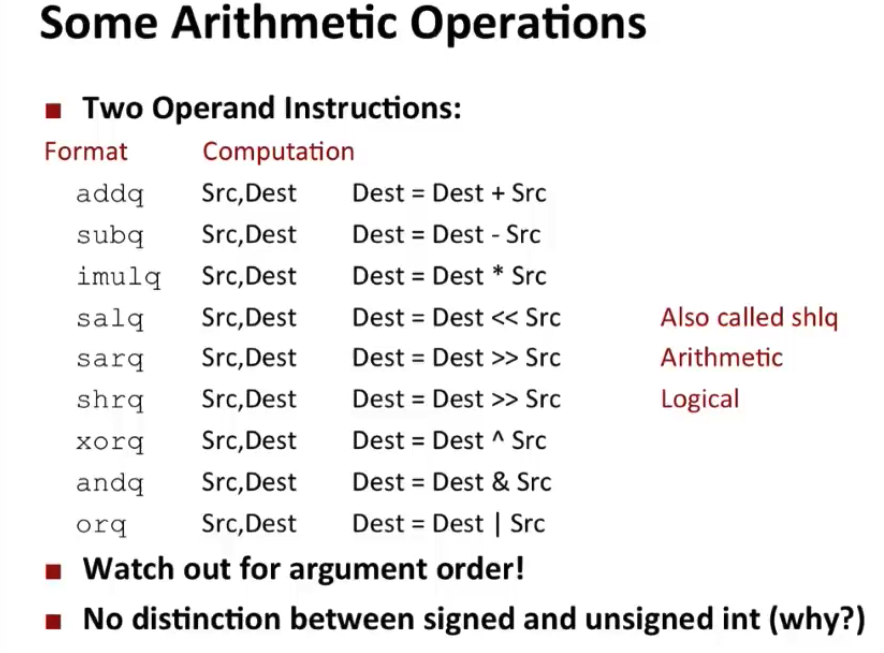
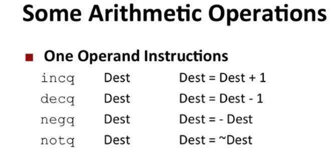
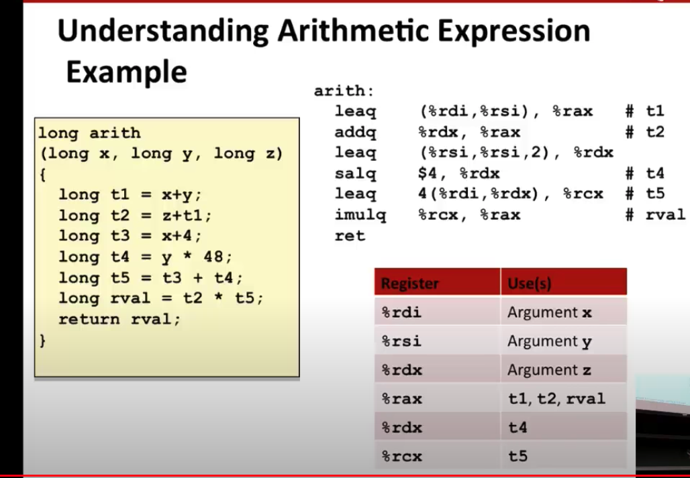

# Machine Level Programming

## History of Intel processors and architectures

### Intel x86 Processors

+ Dominate laptop/desktop/server market
+ Evolutionary design
	+ Backwards compatible up until 8086, introduced in 1978
	+ Added more features as times goes on
+ Complex instruction set computer(CISC)
	+ Many different instructions with many different formats
		+ But, only small subset encounted with Linux programs
	+ Hard to match performance of Reduced Instruction Set Computers(RISC)
+ every processor(cell phones) all 64 bit processors.
+ ARM is also very popular these days, used in most all mobile phones.


## Definitions
+ Architecture: ISA, instruction set architecture, the parts of a processor design that one needs to understand or write assembly/machine code
	+ Examples: instruction set specification, registers
	+ Example ISA: x86, x86-64, ARM
+ Microarchitecture: Implementation of the architecture.
	+ Examples: cache sizes and core frequency(don't need to know this)
+ Code forms:
	+ Machine Code: The byte-level programs that a processor executes
	+ Assembly Code: A text representation of machine code


## Programmer Visible State
+ PC: Program counter
	+ Address of next instruction
	+ Called "RIP"(in x86-64)
+ Register file
	+ Heavily used program data
+ Condition codes
	+ Stores status information about most recent arithmetic or logical operation
	+ Used for conditional branching
+ Momory
	+ Byte addreeable array
	+ Code and user data
	+ Stack to support procedures
	+ Fiction to help understanding: large array of bytes(virtual memory), to make each program that runs on the processor has its own momery
	+ they do share memory in the physical space
+ Cache
	+ Quickly accessable memory

## Turning C into Object Code
+ Code in files p1.c, p2.c
+ Compile with command: `gcc -Og p1.c p2.c -o p`
	+ Use basic optimizations(-Og)
	+ Put resulting binary in file p
+ Process:
	+ text: C program (p1.c, p2.c)
	=> Complier(gcc -Og -S)
	+ text: Asmembly program (p1.s, p2.s)
	=> Assembler(gcc or as)
	+ binary: Object program(p1.o, p2.o)
	=> Linker(gcc or ld) and add in some Static libraries (.a)
	+ binary: Executable program(p)


+ `%r`: actual name of register files
+ `pushq`: push something onto a stack
+ `movq`: copy from one place to another place
+ `call`: call some instruction, in this case `plus`
+ `popq`: the counterpart of `pushq`, pop something from a stack
+ `ret`: exit and return out of this function
+ `-S`: stop, compile from c to assembly
+ `-Og`: O for optimize, g for debugging, optimize to a level that is somehow still readable

## Assembly Characteristics: Data Types
+ "Integer" data of 1, 2, 4 or 8 bytes
	+ Data values
	+ Addresses(untyped pointers)
+ Floating point data of 4, 8 or 10 bytes
+ Code: Byte sequences encoding series of instructions
+ No aggregate types such as arrays or structures
	+ It is an artificial constuct for humans
	+ Just contiguously allocated bytes in memory

## Assembly Characteristics: Operations
+ Perform arithmetic function on register or memory data
+ Transfer data between memory and register
	+ Load data from memory into register
	+ Store register data into memory
+ Transfer control
	+ Unconditional jumps to/from procedures
	+ Conditional branches


## Disassembling Object Code
+ Disassembler
`objdump -d sum`
	+ Useful tool for examining object code
	+ Analyzes bit pattern of series of instructions
	+ Produces approximate rendition of asembly code
	+ Can be run on either a.out(complete executable) or .o file

## x86-64 Integer Registers
+ `%r`: programs manipulate long(double) ints
+ `%e`: programs manipulate short(32 bits) ints
+ Can reference lower-order 3 bytes, also low-order 1 & 2 bytes
+ Register: a namespace(memory) to save and retrive values
+ 8 name registers, 8 number registers
+ `%rsp`: the stack pointer, this one is special

`%rax`	`%r8`
`%rbx`	`%r9`
`%rcx`	`%r10`
`%rdx`	`%r11`
`%rsi`	`%r12`
`%rdi`	`%r13`
`%rsp`	`%r14`
`%rbp`	`%15`

## Moving Data
+ Moving Data: `movq Source, Dest:`
+ Operand Types:
	+ Immediate: Constant integer data
		+ Example: $0x400, $-533
		+ Like C constant, but prefixed with `$`
		+ Encoded with 1, 2, or 4 bytes
	+ Register: One of 16 integer registers
		+ Example: %rax, %r13
		+ %rsp reserved for special use
		+ Others have special uses for particular instructions
	+ Memory: 8 consecutive bytes of memory at address given by register
		+ Simplist example: (%rax)
		+ meaning: use the register as an address(pointer)
		+ Various other "address modes"

+ Movq Operand Combinations:


## Simple Memory Addressing Modes
+ Normal	(R)	Mem[Reg[R]]
	+ `movq (%rcx), %rax`
	+ Register R specifies memory address
	+ temp = *p, dereferencing in C
+ Displacement	D(R)	Mem[Reg[R]+D]
	+ `movq 8(%rbp), %rdx`
	+ Register R specifies the start of memory region
	+ Constant displacement D specifies offset

## Complete Memory Addressing Modes
+ Most General Form: `D(Rb, Ri, S) => Mem[Reg[Rb] + s*Reg[Ri] + D]`
	+ D: Constant "displacement" 1, 2, or 4 bytes
	+ Rb: Base register: Any of 16 integer registers
	+ Ri: Index register: Any, except for %rsp
	+ S: Scale, 1,2,3 or 8
+ Natural form for array reference

## Address Computation Example

```
%rdx -> 0xf000
%rcx -> 0x0100

Expression		Address Computation		Address
0x8(%rdx)		0xf000 + 0x8      		0xf008
(%rdx,%rcx)		0xf000 + 0x0100    		0xf100
(%rdx,%rcx,4)	0xf000 + 4*0100   		0xf400
0x80(,%rdx,2)	0xf000 * 2 + 0x80 		0x1e080
```
## Address Computation Instruction

+ `leaq Source, Dest`
+ leaq: low effective address
+ Source is address mode expression
+ Set Dest to address denoted by expression(Source)
+ Uses:
	+ Computing addresses without a memory reference
		+ E.g. translation of `p = &x[i]`;
	+ Computiong arithmetic expressions of the form x + k*y, k = 1,2,4,or 8

Notes from C:
+ `&` means the <b>address-of</b>, you will see that in placeholders for functions to modify the parameter variable as in C, parameter variables are passed by value, using the ampersand means to pass by reference.
+ `*` means the <b>dereference</b> of a pointer variable, meaning to get the value of that pointer variable.

```C
long m12(long x){
	return x*12
}
```

```assembly
leaq (%rdi, %rdi, 2), %rax  # t <- x+x*2
salq $2, %rax               # return shift left by 2, same as multiple by 4
```





Notes:
`~` is bitwiese not: flits every bit.
It is a great way of finding the largest possible value for an unsigned number:
`unsigned int max = ~0;
0 is 0000000000000000, ~0=111111111111
`



Some Interesting Instructions:
+ leaq: address computation
+ salq: shift
+ imulq: multiplication
